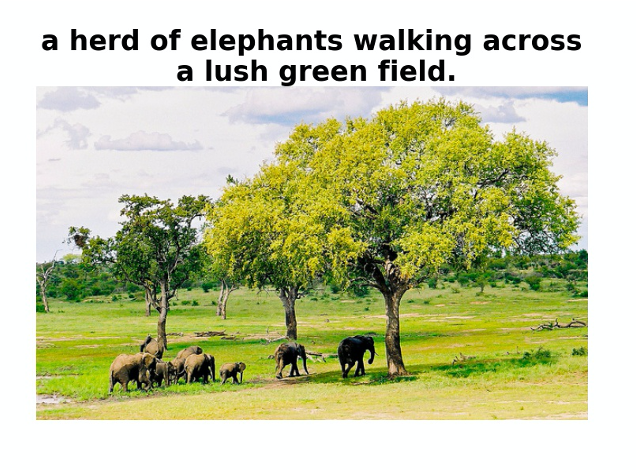
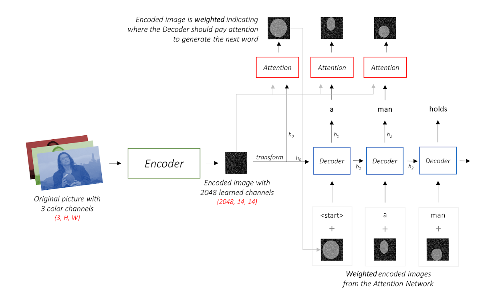
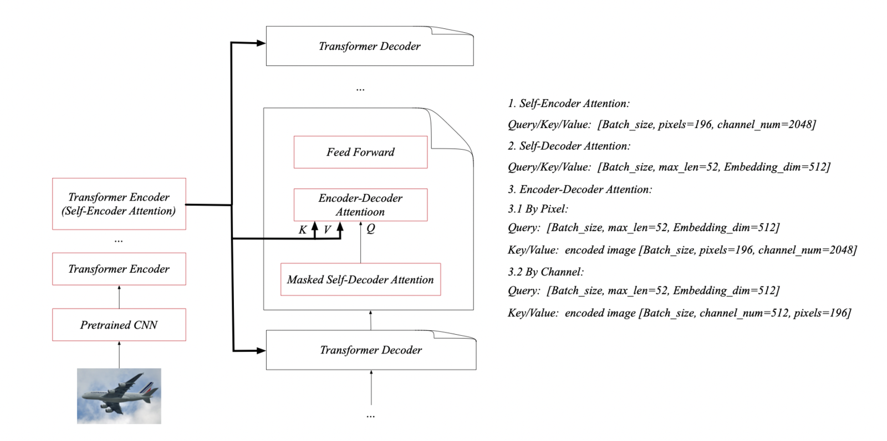
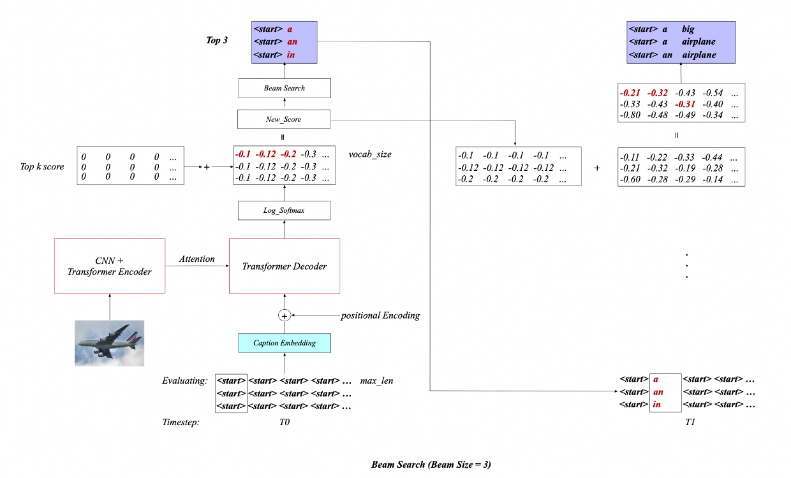
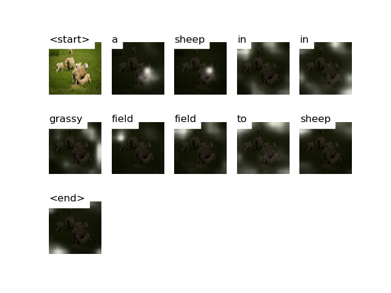
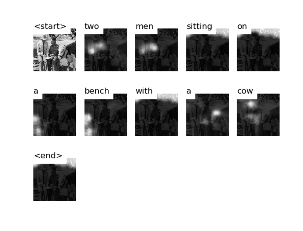

## Image Captioning

**Team members:** [Mollylulu@NTU](https://github.com/Mollylulu), [Skye@NEU/NTU](https://github.com/RoyalSkye), Zhicheng@PKU/NTU

> In this project, we use encoder-decoder framework with Beam Search and different attention methods to solve the image captioning problem, which integrates both computer vision and natural language processing. We compare various results by trying LSTM and Transformer as our decoder and modifying hyperparameters. We also visualize the process of generating captions by attention mechanism. Finally, we evaluate our model by automatic evaluation and human evaluation metrics. Although our model cannot achieve state-of-the-art performance across standard benchmarks on image captioning, it can generate grammatical correctly and expressional accurately captions, and performs well on human evaluation.

**Acknowledgements:** 

* Thanks [sgrvinod](https://github.com/sgrvinod/a-PyTorch-Tutorial-to-Image-Captioning)'s code, which is our baseline for LSTM.
* Thank [ziyanyang](https://github.com/ziyanyang) for fixing abnormal results on GPU(Transformer).

### Section 1: Run

#### 1.1 Dataset

Images: We are using the **MSCOCO'14** Dataset: [Training (13GB)](http://images.cocodataset.org/zips/train2014.zip) and [Validation (6GB)](http://images.cocodataset.org/zips/val2014.zip)

Caption: We will use [Andrej Karpathy's training, validation, and test splits](http://cs.stanford.edu/people/karpathy/deepimagesent/caption_datasets.zip).

Pre-trained Embedding: [Glove.6B.300d.txt](http://nlp.stanford.edu/data/glove.6B.zip)

```shell
# Download dataset to folder ./dataset:
# Please make sure "wget", "unzip" "git" are installed.
$ git clone https://github.com/RoyalSkye/Image-Caption.git 
$ cd Image-Caption
$ mkdir -p ./dataset/caption_dataset
$ wget -b -P ./dataset http://images.cocodataset.org/zips/train2014.zip
$ wget -b -P ./dataset http://images.cocodataset.org/zips/val2014.zip
$ wget -b -P ./dataset http://nlp.stanford.edu/data/glove.6B.zip
$ wget -b -P ./dataset/caption_dataset http://cs.stanford.edu/people/karpathy/deepimagesent/caption_datasets.zip 
# run below code when the dataset has been downloaded.
$ unzip ./dataset/glove.6B.zip -d ./dataset/Glove 
$ unzip ./dataset/train2014.zip -d ./dataset
$ unzip ./dataset/val2014.zip -d ./dataset
$ unzip ./dataset/caption_dataset/caption_datasets.zip -d ./dataset/caption_dataset
$ rm -rf ./dataset/*.zip ./dataset/caption_dataset/*.zip
```

Now, the original datasets, including two image dataset folders and one caption dataset, are all set.

#### 1.2 Environment Set Up

We are using `conda` to set up our environment.

```shell
$ conda create -n nlp -y python=3.7
$ conda activate nlp 
$ pip install torch torchvision h5py tqdm imageio nltk
```

Moreover, `Java 1.8.0` (or higher) is needed for the evaluation method "METEOR".

#### 1.3 Modules

**create_input_files.py**

Before training, you should run this module to generate required data files. (10 files)

> * TEST/TRAIN/VAL_CAPLENS_X.json: the length of each caption.
>* TEST/TRAIN/VAL_CAPTIONS_X.json: all captions of images.
> * TEST/TRAIN/VAL_IMAGES_X.hdf5: image data, stored in hdf5 format.
>* WORDMAP_X.json: A dictionarty that converts words into id.

Parameters:

>* --dataset: which dataset we used, either 'coco', 'flickr8k' or 'flickr30k'.
>* --karpathy_json_path: path of captions dataset.
>* --image_folder: path of image dataset.
>* --captions_per_image: how many captions each image has?
>* --min_word_freq: the frequency of words less than it will be <unk>.
>* --output_folder: output file path.
>* --max_len: the maximum length of each caption.

**train.py**

In this module, you can easily check or modify the parameters you wish to. You can train your model from scratch, or resume training at a checkpoint by point to the corresponding file with the checkpoint parameter. It will also perform validation at the end of every training epoch.

 This module has too many parameters, so we only introduce parts of them.

You can modify model parameters to change the structure of the network. In our implementation, there are two attention methods: `ByPixel` and `ByChannel`, and two decoder modes: `lstm` and `transformer`. Training parameters are used to control the hyperparameters of learning such as learning rate and batch size. "alpha_c" is the weight assigned to the second loss, and checkpoint is the path of the previous model. All parameters are shown in below table.

|      **Type**       | **Parameters**                                               |
| :-----------------: | ------------------------------------------------------------ |
| Dataset parameters  | -data_folder; --data_name;                                   |
|  Model parameters   | --emb_dim; --attention_dim; --decoder_dim; --n_heads; </br>--dropout;  --decoder_mode; --attention_method; </br>--encoder_layers; --decoder_layers; |
| Training parameters | --epochs; --stop_criteria; --batch_size; --print_freq; </br>--workers; --encoder_lr; --decoder_lr; --grad_clip; </br>--alpha_c; --checkpoint; --fine_tune_encoder;</br> --fine_tune_embedding; --embedding_path; |

**datasets.py**

A PyTorch Dataset class to be used in a PyTorch DataLoader to create batches.

**models.py**

The PyTorch neural network class of CNN and LSTM.

**transformer.py**

The PyTorch neural network class of Transformer.

**eval.py**

Evaluating the trained model by generating the caption, and getting the score of automatic evaluation metrics, including `BLEU 1-4`, `METEOR`, `ROUGE_L` and `CIDEr`. There are two differences between the training and evaluating process. In the process of evaluation, we used beam search to generate the captions. The previous output of our model is the input at the next timestep. 

Parameters:

>* --data_folder: folder with data files saved by create_input_files.py.
>* --data_name: base name shared by data files.
>* --decoder_mode: which network does the decoder of the model use?
>* --beam_size: beam search hyperparameters.
>* --checkpoint: the path of a trained model.

**caption.py**

Read an image and caption it with beam search. The output of this module is a generated caption and the visualization of attention.

Parameters:

> * --img: path of images, it can be a single img file or a folder filled with img.
> * --checkpoint: the path of a trained model.
> * --word_map: path of wordmap json file generated by create_input_files.py.
> * --decoder_mode: which network does the decoder of the model use?
> * --save_img_dir: path to save the output file.
> * --beam_size: beam search hyperparameters.
> * --dont_smooth: do not smooth alpha overlay.

**utils.py**

This module consists of some useful functions (e.g. "get_eval_score"), which are called many times. To keep the code clean, we move them into this module.

#### 1.4 Run

Please make sure you’re in the directory of our project code folder now.</br>Activate the conda environment. We will use nohup in the process of training and evaluating.

```shell
$ conda activate nlp 
$ chmod 755 *.py
# Default setting: 
# Note: Please run eval.py and caption.py on CPU! See Also 4.3.3
$ python create_input_files.py
$ nohup python -u train.py --decoder_mode="lstm" > lstm.out 2>&1 &
$ nohup python -u eval.py --decoder_mode="lstm" > eval_lstm.out 2>&1 &
$ python caption.py --decoder_mode="lstm"
or
$ nohup python -u train.py --decoder_mode="transformer" > transformer.out 2>&1 &
$ nohup python -u eval.py --decoder_mode="transformer" > eval_transformer.out 2>&1 &
$ python caption.py --decoder_mode="transformer"
```

> *Below is the detailed instructions on how to run each module. You can skip this part if you are usinig the default value and setting.*

**Generating data files**: Firstly, we need to generate data files (e.g. wordmap) according to the original dataset. You should use the default value of the parameters, since we need the path of generated data later.

```shell
$ ./create_input_files.py --karpathy_json_path="./dataset/caption_dataset/dataset_coco.json" --dataset="coco" --image_folder="./dataset" --output_folder="./dataset/generated_data" 
# Now, the dataset folder structure is shown below:
├── dataset
│   ├── Glove
│   ├── caption_dataset
│   ├── generated_data
│   ├── train2014
│   └── val2014
```

**Training:** Train model from scratch, or resume training at a checkpoint by point to the corresponding file with the checkpoint parameter. We will use the default value and dataset path. The commands are shown below:

> CNN_LSTM: Train model from scratch without pre-trained Embedding, attention method is `ByPixel`
>
> ```shell
> $ nohup python -u train.py --decoder_mode="lstm" --attention_method="ByPixel" --embed_dim=300 --dropout=0.1 --attention_dim=512 --decoder_dim=512 --alpha_c=1.0 --fine_tune_encoder=False --encoder_lr=0.0001 --decoder_lr=0.0001  2>&1 &
> ```
>
> CNN_Transformer: Train model from scratch with pre-trained Embedding, attention method is `ByPixel`
>
> ```shell
> $ nohup python -u train.py --data_folder="./dataset/generated_data" --n_heads=8 --dropout=0.1 --decoder_mode="transformer" --attention_method="ByPixel" --encoder_layers=2 --decoder_layers=6 --encoder_lr=0.0001 --decoder_lr=0.0001 --alpha_c=1.0 --fine_tune_encoder=False --embedding_path="./dataset/Glove/glove.6B.300d.txt" --fine_tune_embedding=False 2>&1 &
> ```
>
> CNN_Transformer: Train model from scratch without pre-trained Embedding, attention method is `ByChannel`
>
> ```shell
> $ nohup python -u train.py --data_folder="./dataset/generated_data" --n_heads=8 --dropout=0.1 --decoder_mode="transformer" --attention_method="ByChannel" --encoder_layers=2 --decoder_layers=6 --encoder_lr=0.0001 --decoder_lr=0.0001 --alpha_c=1.0 --fine_tune_encoder=False 2>&1 &
> ```
>
> Resume training at a checkpoint (**Prerequisite**: You have a checkpoint.)
>
> ```shell
> $ nohup python -u train.py --data_folder="./dataset/generated_data" --checkpoint="./BEST_checkpoint_coco_5_cap_per_img_5_min_word_freq.pth.tar" --fine_tune_embedding=True --fine_tune_encoder=True --encoder_lr=0.0001 2>&1 &
> ```

**Evaluating:** Evaluating the trained model with `Beam Search` using test dataset. The score of automatic evaluation metrics will be provided.

```shell
$ nohup python -u eval.py --data_folder="./dataset/generated_data" --decoder_mode="transformer" --beam_size=3 --checkpoint="./BEST_checkpoint_coco_5_cap_per_img_5_min_word_freq.pth.tar" 2>&1 &
```

**Captioning:** Read an image and caption it with beam search. The output of this module is a generated caption and the visualization of attention.

```shell
$ ./caption.py --img="./dataset/val2014/COCO_val2014_000000581886.jpg" --decoder_mode="transformer" --save_img_dir="./caption" --beam_size=3 --checkpoint="./BEST_checkpoint_coco_5_cap_per_img_5_min_word_freq.pth.tar" --word_map="./dataset/generated_data/WORDMAP_coco_5_cap_per_img_5_min_word_freq.json"
```

### Section 2: Introduction

#### 2.1 NLP Task

Benefited by advanced methods based on deep neural networks, machine translation has made great progress. The convolutional neural network, recurrent neural network, LSTM and attention are pushing the processing of natural language further. This advance also attracts much research combining natural language processing. Typically, image captioning surges in recent study, which integrates both computer vision and natural language processing tasks. Certainly, it also benefits from the large dataset. Image captioning can also be regarded as a machine translation task, which requires to translate image information into natural language.

<p align="center">
  </br>
  Figure 1: Image Captioning
</p>

Literally, image caption means capturing the information in the images and then express it using natural language. The information from an image can be seen as the source sequence, by which using a language model to decode this encoded information and generate target sentences constrained. The end-to-end training is the current mainstream method for deep neural network-based models and encoder-decoder architecture is mainly used for sequence-to-sequence learning. RNN, LSTM and attention are mainly used to generate sequences.

Considering the gradient vanishing problem with RNN and information would also be diluted in the long term in LSTM, we adopt the transformer [1] as our decoder to handle this task and LSTM-based method is used as our baseline. The fact that attention exists in human visual system [2, 3] suggests the efficient way of representing. Transformer is exactly using attention to help the model learn *where* to look. As generating a caption, word by word, *Attention allows the* model’s gaze shift across the image, by focusing on the part of the image most relevant to the word it is going to utter next. 

#### 2.2 Data Preprocessing

There are three inputs for our model:

- **Images**

  As we're using a pretrained CNN Encoder--Resnet101 [4], we need to process the images into the format to which this pretrained Encoder is accustomed. The pretrained Resnet101 is provided by Pytorch [5]. Specifically, we need to normalize the images, ensuring the pixel values are in the range[0, 1]. Also, Along with the NCHW convention, PyTorch requires that the channels dimension (C) must precede the size dimensions. Moreover, we resize all MSCOCO images to 256x256 for uniformity. Finally, we would feed a _Float tensor_ with dimension(N, 3, 256, 256) into the model.

- **Captions**

  Captions are both the target and the inputs of the decoder as each word is used to generate the next word. To generate the first word, however, we need a *zeroth* word, <start> token. At the end of the sentence, we should also generate the <end> token, telling the decoder when to stop during generating the sentence. i.e., `<start> a man holds a football <end>`.

  Since we pass the captions around as fixed size tensors, we need to pad captions (which are naturally of varying length) to the same length with <pad> tokens. i.e., `<start> a man holds a football <end> <pad> <pad> <pad> ...` Furthermore, we create a *word_map* which is an index mapping for each word in the corpus, including the <start>,<end>, and <pad> tokens. As we need to encode words as indices to look up embeddings for them and to identify their place from the predicted word scores. Then, we would feed an _Int tensor_ with dimension (N, L) into the model, where L is the padded length.

- **Caption Length**

  Due to the captions being padded, we would need to keep track of the lengths of each caption. This is the actual length plus two (for the <start> and <end> tokens), as we hope to save computation from the <pad> tokens and only process a sequence up to its length. Therefore, caption lengths fed to the model must be an _Int tensor_ of dimension (N, L), where L is the caption length.

### Section 3: Methodology

> In this part, we will specify the details of our method we used in codes. When a batch of images is created, they will first through a CNN to extract their features, and then put into the decoder to generate captions. There are two kinds of decoder, one is Transformer and the other is LSTM. While Training, both of them use `Teacher Forcing` which means use ground-truth as input at each decode-step instead of the word last generated. When doing captions and evaluation, they both use beam search to improve performance.

#### 3.1 CNN

We choose 101 layered Residual Network trained on the ImageNet classification task as our images encoder, because this pre-trained CNN has extraordinary good performance in classifying an image with a thousand categories and it could be easily imported from library named " torchvision ".

But we still need to notice some points, one is that this pre-trained CNN model was used to classify images, so the last two layers are linear layers with softmax function which need be deleted when utilizing. 

Another thing is that when we did our model pre-experiments to find good parameters as our final training choice and trained our final models in the first several epochs, we prohibited update of weights on it otherwise that might destroy the pre-trained CNN weight when starting training if the gradients are too big. 

The output size of CNN encoder is (Batch, 2048, 14, 14), but if the attention method in our transformer model is ByChannel then the output size is (Batch, 512, 14, 14). Because we have added one more CNN layer to decrease the channel size to 512 otherwise Memory Overflow Error would be occur since there were too many features as transformer encoder input.

#### 3.2 LSTM

The process of decoding shows in the picture below.

<p align="center">   
  </br>
  <a href="https://github.com/sgrvinod/a-PyTorch-Tutorial-to-Image-Captioning">Figure 2: CNN-LSTM</a>
</p>

After CNN encoder, an image shaped in (14, 14, 2048) is split into 196 2048-dimensional vectors as the keys for every step of decoder words' queries. The initial hidden layer h0 (as well as cell layer c0) is obtained by transforming image features. The specific process is averaging the CNN encoder output features on the first two dimensions to get a (1, 1, 2048) tensor and squeeze it into a 2048-dimensional vector. Then two different linear layers were utilized to obtain the initial hidden layer h0 and cell layer c0.

For every decode step, a word from ground-truth (when training) or previous generation (when evaluating or doing captions) concatenated with an attention vector, which is obtained from this word embedding and feature vectors of CNN image output, will be passed to the LSTM with previous hidden layer and the cell layer to generate the next word prediction probabilities and the next hidden and cell layers.

This process will end before generating predictions from `<end>` (when training) or when generating a `<end>` (when caption and evaluation).

#### 3.3 Transformer

##### 3.3.1 Origin Motivation 

At the beginning, we wanted to do a QA task when the project was assigned and found that BERT is a new and powerful method in many NLP tasks including QA. And transformer structure is a very import part in BERT. Later we think QA task is not very interesting and might be chosen by many other groups, so we chose the image-caption task and applied transformer structure to it. 

Attention is a very essential part in transformer because many layers output generating is based on attention. We have offered two attention methods in our task, ByPixel and ByChannel.

##### 3.3.2 By Pixel

The output size of an image features extracted by the CNN encoder is (14, 14, 2048). This output tensor will be cut into 14x14 segments and each segment is a 2048-dimensional vector. These 196 vectors would be put into transformer encoder to extract features further, but before that, positional-encoding is needed because the encoder of transformer has no abilities to recognize the input order.

Because different from sequences, every image feature has two dimension, so our approach of positional-encoding is a kind of spatial-encoding. There are 14x14 pixels we need to encode, and for every pixel we need to form a 2048-dimensional vector as its positional-encoding. Suppose the pixel is in the position (x,y) (0≤x,y≤13), we form a 1024-dimensional vector to represent its vertical position x feature, and form another 1024-dimensional vector to represent its horizontal position y feature, then concatenate these two vectors to obtain its final 2048-dimensional position feature vector. As well as encoder input, the decoder input of transformer needs positional-encoding. The method for transformer decoder input vector positional-encoding is a usual method.
Decoder positional-encoding:

<p align="center">
  
</p>

Encoder positional-encoding:

<p align="center">
  
</p>

<p align="center">
  
</p>

After positional-encoding, encoded image features will be put into transformer encoder to obtain transformer encoded feature. When training, the whole target captions will put into decoder part of transformer to obtain predictions for all sequence positions. This is different from LSTM which could only predict one next word when training. And in real training, transformer is quite faster than LSTM. When making caption of evaluating, it is same as LSTM, we could only predict one word from the previous generated word for every step. 

Figure 3 shows the structure of our transformer:

<p align="center">   
  </br>
  Figure 3: Structure of Transformer
</p>

Where M, N is the number of transformer encoder and decoder layer respectively. K, V, Q are keys, values and queries which dim could be predesigned. Output Embedding is word embedding and its size would be specified before training. In our training, we used a glove.300d to be a pre-trained word embedding.

##### 3.3.3 By Channel

By Channel attention method has only a few differences from by pixel. As previously mentioned, CNN encoder has one addition conv2d (with Relu func.) to reduce image features from 2048 to 512. The segmentation method of by channel is splitting the image feature (14, 14, 512) into 512 196-dimensional vectors. And there is no positional-encoding before putting these vectors into transformer encoder, because it seems meaningless to decide an order of the extracted features (channel order). The rest process is the same as by pixel.

By the way, the main reason of decreasing image features, is to solve the problem of memory overflow error. We thought of three methods to solve it, one is decreasing the QKVdim (attention dimension) or heads number of multi-head attention, another is decreasing batchsize or add more dropout, but we finally thought that decreasing the feature is more effective than others, and presented faster training speed.

<p align="center">   
  </br>
  Figure 4: Beam Search in Transformer
</p>

##### 3.3.4 Loss Function

With regard to loss function, the total loss is equal to the CrossEntropy between predicted captions and target captions add the attention alpha loss. The alpha loss aims at making decoder-encoder attention cares everywhere of an image and not pay too much attention on the same part of an image. It makes the attention system not miss information from the image and prevent generated captions have many repeated words. 

If the attention method is by channel, for a caption sentence every word in it has a decoder-encoder alpha weight. These weights represent how much attention that every word paid to pixels (196 pixels in total). Then it computes the sum of these words attention weights for every pixel and compare it to 1, and the closer to 1, the smaller loss. Suppose the sum of weights at pixel (x,y) (0≤x,y≤13) is , then the alpha loss is . This is the alpha loss on one head of multi-attention on one decoder layer. We compute all heads in all decoder layers alpha loss and average them as final alpha loss and add a coefficient before it to control the strength of alpha loss.
<p align="center">

#### 3.4 Beam Search

Figure 5 reflects the process of beam search on our transformer model. In this picture, the beam size is 3.

<p align="center">   
  </br>
  Figure 5: Beam Search in Transformer
</p>

At the beginning, when we get a picture, we will input `<start>` embedding filled tensor with size (BeamSize=3, max_len=52, EmbeddingSize) to the transformer decoder (here the BatchSize is equal to BeamSize). Then it will give the score for the first word prediction (although it will give predictions for words at all positions, we only care the first position at the start). Then it will choose 3 words ('a', 'an', 'in' in the picture) which have highest 3 scores and put them to the second position in the next word prediction input. For every step, we will input a tensor filled with previous generated words, and we do not need to care about what word we put on input if this word position is bigger than the step iterations because of the sequence mask makes prediction only cares words before them. Then it will give prediction scores for every word in vocabulary for every sequence we put in. Next, it will add these scores and the score of the sequence from which this word generated, and find highest 3 score words. When a sequence is completed (meet `<end>`), we should reduce the input BatchSize. When all the sequences are completed or it has gone to step 52 (sequence max length), it will stop the beam search and output the sentence with highest score.

There is a small defect of our transformer beam search. When we generate the word at position k (1≤k≤52), we still use a tensor with second dimension 52 as input for convenience (the normal way is to input a tensor with second dimension k), it is not a problem, but could make it a little slower when caption. Even so,  comparing to the training time, this is a really negligible defect.

The beam search method for LSTM is almost the same as transformer, but it will only use previously generated words as input for every decode step rather than the whole generated sentence, because LSTM remembers the previous inputs in its hidden and cell layers as the next word prediction context.

### Section 4: Evaluation

Image captioning result is evaluated based on correctness as natural language and relevance of semantics to its respective image. Automatic metrics, however, is not enough to adequately capture overall quality. Thus, we also introduce human evaluation.

#### 4.1 Automatic Evaluation

We use `BLEU 1-4`, `CIDEr`, `ROUGE`, `METEOR` to eval the performance of the model. Basically, they are based on n-gram to evaluate the quality of the generated sentences compared with reference ones. N-gram overlap, though, is neither necessary nor sufficient for the task for simulating human judgement in caption evaluation, they can help us track some important qualities that we care about.

#### 4.2 Human Evaluation

Although human evaluation is not efficient, it still is regarded as the gold standard when we evaluate the generated sentences. For humans, the judgement would be very subjective, as different people would have different responses towards the candidate sentences. Meanwhile, overall quality depends on many underlying factors. It is hard to have a uniformed rule to regularize this kind of evaluation. Here, we try to cover the most import factors in sentence evaluating and give grade ranging from 1 to 5:

- Grammaticality (Incorrect – Correct);
- Adequacy (Undetailed – Detailed);
- Readability (Disfluency – Fluency);
- Logic (Nonsensical – Logical);
- Humanness (How likely they would be to use the texts in a real-world context);

#### 4.3 Experiment Result

We choose 3 groups of parameters which have a better performance in pre-experiments. Table 2 shows the evaluation result of our model on validation dataset with tearcher forcing. Table 3 compares LSTM with our `current` best model of Transformer. Both of them are trained for 30 epochs. Due to the limited computation resource, we are not allowed to try too many different hyperparameters of Transformer so that it can outperform LSTM in limited training time.

|   Name   | **Encoder Layers** | **Decoder**  **Layers** | **N heads** | **Dropout** | **Attention   Method** | **Encoder lr** | **Decoder lr** | **Alpha c** |
| :------: | :----------------: | :---------------------: | :---------: | :---------: | :--------------------: | :------------: | -------------- | ----------- |
| **T-P1** |         2          |            2            |      8      |     0.1     |        ByPixel         |      1E-4      | 1E-4           | 1.0         |
| **T-P2** |         6          |            6            |      8      |     0.1     |        ByPixel         |      1E-4      | 1E-4           | 2.0         |
| **T-P3** |         2          |            4            |      8      |     0.1     |        ByPixel         |      1E-4      | 1E-4           | 1.0         |

<p align="center">Table 1: Three group of parameters</p>

| Decoder  | **BLEU1** | **BLEU2** | **BLEU3** | **BLEU4** | **METEOR** | **ROUGE_L** | **CIDEr** | Human Eval |
| :------: | :-------: | :-------: | :-------: | :-------: | :--------: | :---------: | :-------: | :--------: |
| **LSTM** |  0.7212   |  0.5160   |  0.3488   |  0.2369   |   0.2736   |   0.5700    |  0.8265   |    3.5     |
| **T-P1** |  0.7167   |  0.5123   |  0.3474   |  0.2363   |   0.2730   |   0.5697    |  0.8178   |    3.5     |
| **T-P2** |  0.7191   |  0.5143   |  0.3484   |  0.2370   |   0.2747   |   0.5737    |  0.8253   |     4      |
| **T-P3** |  0.7278   |  0.5248   |  0.3579   |  0.2445   |   0.2773   |   0.5776    |  0.8422   |     4      |

<p align="center">Table 2: Evaluation Result on Val Dataset with Teacher Forcing (10 epochs)</p>

|            |  LSTM  | Transformer(T-P2) |
| :--------: | :----: | :---------------: |
|   BLEU-1   | 0.7217 |      0.7152       |
|   BLEU-2   | 0.5547 |      0.5407       |
|   BLEU-3   | 0.4206 |      0.4049       |
|   BLEU-4   | 0.3188 |      0.3029       |
|   METEOR   | 0.2621 |      0.2573       |
|  ROUGE_L   | 0.5339 |      0.5260       |
|   CIDEr    | 0.9909 |      0.9786       |
| Human Eval | 4.1/5  |       4.0/5       |

<p align="center">Table 3: Evaluation Result on Test Dataset without Teacher Forcing (Beam Size=3)</p>

#### 4.4 Error Analysis

##### 4.4.1 Repeated Words

During our experiment, we were faced with generating repeated words. We suspect that it is because the attention is paid to the same area multiple times. Trying to tackle this issue, we introduced the second loss---alpha loss to the total loss and increase the coefficient of loss alpha, which helps the attention system pay attention to different parts of the image.

<p align="center">   
  </br>
  Figure 6: Repeated Words
</p>

##### 4.4.2 Attention/Object Recognition

Moreover, it occurs model paid attention to the wrong area and object recognition errors, which are solved by fine-tuning the CNN module. There is an example, where a man was recognized as a woman. After fine-tune, it is recognized correctly as two men, shown in the below figures.

<p align="center">   
  
  
  </br>
  Figure 7: Attention/object recognition error
</p>

##### ~~4.4.3 GPU/CPU - Float Computational Accuracy~~ (*Solved*)

As the experiment going, we found that our transformer model don't have a good performance in `eval` module. However, the caption result seems to be grammatical correctly and expressional accurately in our local PC. After debugging, we found that the same model with the same input would generate different captions if they run on GPU and CPU respectively. The result of CPU is pretty good both on automatic evaluation and human evaluation, but the result of GPU is lack of words, and makes no sense compared with the one generated on CPU. This situation may be caused by the difference between CPU and GPU on `float computational accuracy`. We still have no idea about how to solve it except running our `eval` and `caption` module on CPU. Below table shows the case we met.

>Reference0:  ['a', 'man', 'with', 'a', 'red', 'helmet', 'on', 'a', 'small', 'moped', 'on', 'a', 'dirt', 'road']  
>Reference1:  ['man', 'riding', 'a', 'motor', 'bike', 'on', 'a', 'dirt', 'road', 'on', 'the', 'countryside']  
>Reference2:  ['a', 'man', 'riding', 'on', 'the', 'back', 'of', 'a', 'motorcycle']  
>Reference3:  ['a', 'man', 'in', 'a', 'red', 'shirt', 'and', 'a', 'red', 'hat', 'is', 'on', 'a', 'motorcycle', 'on', 'a', 'hill', 'side']  
>Reference4:  ['a', 'dirt', 'path', 'with', 'a', 'young', 'person', 'on', 'a', 'motor', 'bike', 'rests', 'to', 'the', 'foreground', 'of', 'a', 'verdant', 'area', 'with', 'a', 'bridge', 'and', 'a', 'background', 'of', 'cloud', '<unk>', 'mountains']
>
>* **CPU: Hypotheses:  ['a', 'man', 'is', 'riding', 'a', 'motorcycle', 'on', 'a', 'dirt', 'road']**
>
>| Bleu_1 | Bleu_2 | Bleu_3 | Bleu_4 | METEOR | ROUGE_L | CIDEr  |
>| :----: | :----: | :----: | :----: | :----: | :-----: | :----: |
>| 0.9999 | 0.8819 | 0.7299 | 0.5774 | 0.2952 | 0.6261  | 1.9781 |
>
>* **GPU: Hypotheses:  ['a', 'man', 'riding', 'a', 'a', 'top', 'back']**
>
>| Bleu_1 | Bleu_2 | Bleu_3 |  Bleu_4  | METEOR | ROUGE_L | CIDEr  |
>| :----: | :----: | :----: | :------: | :----: | :-----: | :----: |
>| 0.6441 | 0.4920 | 0.4175 | 6.08e-05 | 0.2634 | 0.4890  | 1.0489 |
>

### Section 5: Recent Research Work and Future

>* Show, Attend and Tell [6]: Bring image captioning problem into the deep learning field
>* Knowing When to Look [7], SCA-CNN [8], and  Bottom-Up Attention [9]: Various attention methods.
>* Self-critical Sequence Training [10]: Optimize image captioning systems using reinforcement learning
>* Neural Baby Talk [11]: Generate a sentence ‘template’ with slot locations explicitly tied to specific image regions.
>* Auto-Encoding Scene Graphs for Image Captioning [12]: Incorporate the language inductive bias into the encoder-decoder image captioning framework for more human-like captions.

<h3 align="center">Reference</h3>

[1]:Vaswani, Ashish, et al. "Attention is all you need." *Advances in neural information processing systems*. 2017.

[2]:Rensink, R. A. "The dynamic representation of scenes. Visual Cognition7: 1742.[aZWP](2000b) Visual search for change: A probe into the nature of attentional processing." *Visual Cognition* 7 (2000): 34576.

[3]:Corbetta, Maurizio, and Gordon L. Shulman. "Control of goal-directed and stimulus-driven attention in the brain." *Nature reviews neuroscience* 3.3 (2002): 201-215.

[4]:He, Kaiming, et al. "Deep residual learning for image recognition." *Proceedings of the IEEE conference on computer vision and pattern recognition*. 2016.

[5]: [Resnet from Pytorch](https://pytorch.org/docs/master/torchvision/models.html)

[6]: Xu, Kelvin, et al. "Show, attend and tell: Neural image caption generation with visual attention." *International conference on machine learning*. 2015.

[7]: Lu, Jiasen, et al. "Knowing when to look: Adaptive attention via a visual sentinel for image captioning." *Proceedings of the IEEE conference on computer vision and pattern recognition*. 2017.

[8]: Chen, Long, et al. "Sca-cnn: Spatial and channel-wise attention in convolutional networks for image captioning." *Proceedings of the IEEE conference on computer vision and pattern recognition*. 2017.

[9]: Anderson, Peter, et al. "Bottom-up and top-down attention for image captioning and visual question answering." *Proceedings of the IEEE conference on computer vision and pattern recognition*. 2018.

[10]: Rennie, Steven J., et al. "Self-critical sequence training for image captioning." *Proceedings of the IEEE Conference on Computer Vision and Pattern Recognition*. 2017.

[11]: Lu, Jiasen, et al. "Neural baby talk." *Proceedings of the IEEE conference on computer vision and pattern recognition*. 2018.

[12]: Yang, Xu, et al. "Auto-encoding scene graphs for image captioning." *Proceedings of the IEEE Conference on Computer Vision and Pattern Recognition*. 2019.
